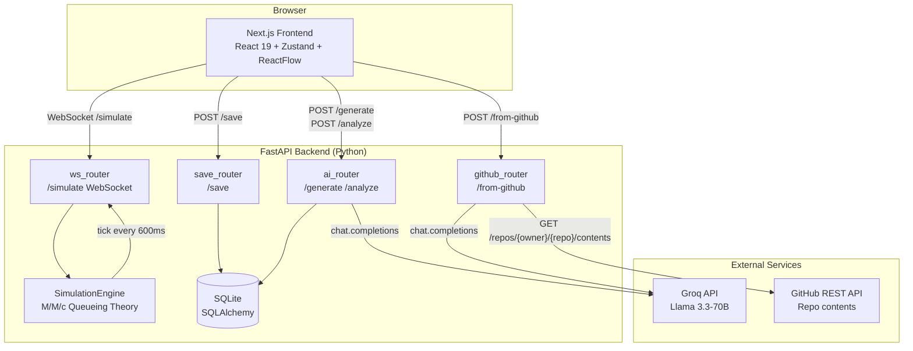
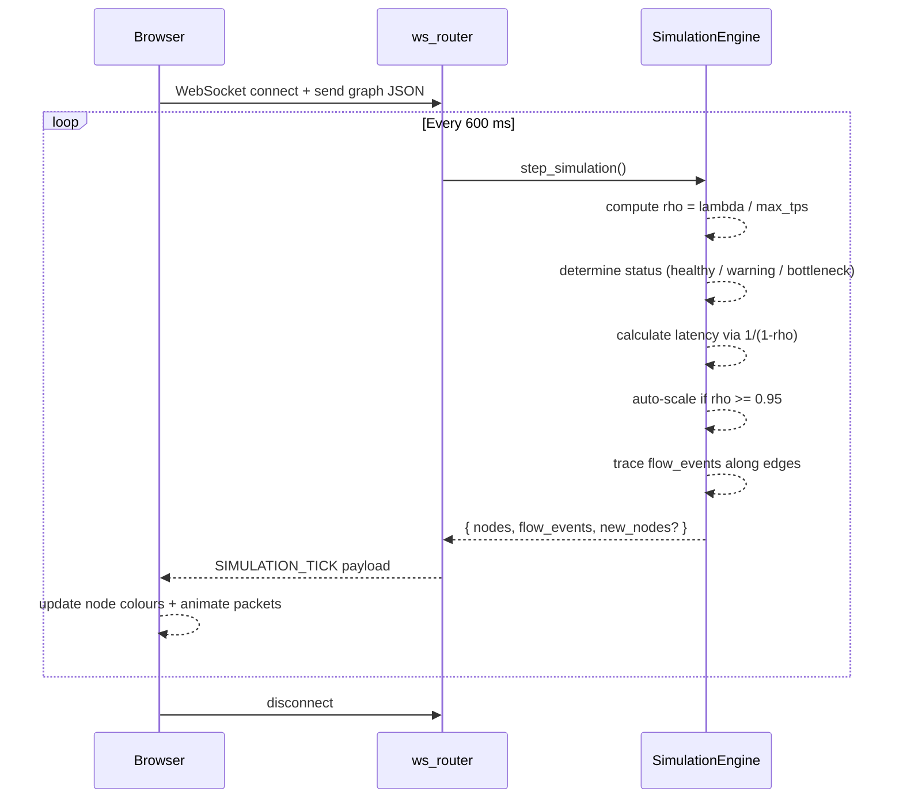
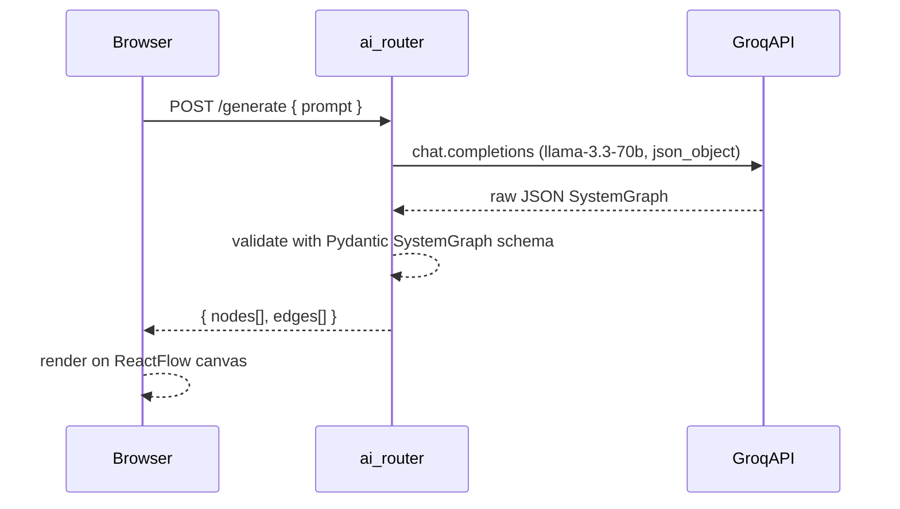

# Archflow

A local-first system design workbench. Describe any architecture in plain language or paste a GitHub repository URL, and Archflow generates an interactive visual diagram. Run a simulation to watch traffic flow through your design — with animated packets, queueing-theory math, and auto-scaling — then export to PNG or save to the local database.

---

## Architecture



### Data flow during simulation



### AI generation flow



---

## Tech Stack

| Layer          | Technology                                      |
|----------------|-------------------------------------------------|
| Frontend       | Next.js 16, React 19, TypeScript                |
| State          | Zustand 5                                       |
| Canvas         | ReactFlow 11                                    |
| Styling        | Tailwind CSS 4                                  |
| Animations     | Framer Motion, SVG animateMotion                |
| Backend        | FastAPI 0.135, Python 3.14                      |
| ORM            | SQLAlchemy 2.0                                  |
| Database       | SQLite (default) / PostgreSQL (optional)        |
| AI             | Groq API — Llama 3.3-70B                        |
| Real-time      | WebSocket (native FastAPI + websockets 16)      |
| HTTP client    | httpx (async GitHub API calls)                  |
| Export         | html-to-image                                   |

---

## Project Structure

```
Systm_design/
├── backend/
│   ├── main.py                 FastAPI app, CORS, router registration
│   ├── ai_router.py            /generate and /analyze endpoints
│   ├── github_router.py        /from-github — repo reverse engineering
│   ├── ws_router.py            WebSocket /simulate endpoint
│   ├── save_router.py          /save — persist canvas to DB
│   ├── collab_router.py        Placeholder for future collaboration
│   ├── simulation_engine.py    M/M/c queueing math + auto-scaling
│   ├── schemas.py              Pydantic models (SystemGraph, NodeData)
│   ├── models.py               SQLAlchemy ORM (User, Project, Version)
│   ├── database.py             DB engine + session factory
│   ├── requirements.txt
│   ├── .env.example            Copy to .env and fill in keys
│   └── .env                    Local secrets — never committed
│
└── frontend/
    ├── src/
    │   ├── app/
    │   │   ├── page.tsx                Landing page
    │   │   ├── layout.tsx              Root layout + metadata
    │   │   ├── globals.css             Tailwind + custom animations
    │   │   └── workspace/page.tsx      Main canvas workspace
    │   ├── components/
    │   │   ├── Canvas.tsx              ReactFlow canvas + drag-drop
    │   │   ├── AiPrompt.tsx            Floating prompt bar
    │   │   ├── FeedbackPanel.tsx       AI analysis results
    │   │   ├── NodeDetailPanel.tsx     Right sidebar — node inspector
    │   │   ├── NodePalette.tsx         Left sidebar — drag-to-add nodes
    │   │   ├── DataFlowPanel.tsx       Bottom — live packet log
    │   │   ├── ChallengePanel.tsx      Scenario challenge tracker
    │   │   ├── edges/
    │   │   │   └── PacketEdge.tsx      Animated packet edge (SVG animateMotion)
    │   │   └── nodes/
    │   │       ├── ApiNode.tsx
    │   │       ├── DatabaseNode.tsx
    │   │       ├── CacheNode.tsx
    │   │       ├── QueueNode.tsx
    │   │       ├── LoadBalancerNode.tsx
    │   │       └── CustomNode.tsx
    │   └── store/
    │       └── useStore.ts             Zustand store — all app state
    ├── package.json
    ├── next.config.ts
    ├── tailwind.config.js
    └── postcss.config.mjs
```

---

## Local Setup

### Prerequisites

- Python 3.11 or later
- Node.js 18 or later
- A free [Groq API key](https://console.groq.com)

### 1. Clone

```bash
git clone https://github.com/your-username/archflow.git
cd archflow
```

### 2. Backend

```bash
cd backend

# Create and activate a virtual environment
python -m venv venv
venv\Scripts\activate        # Windows
# source venv/bin/activate   # macOS / Linux

# Install dependencies
pip install -r requirements.txt

# Configure environment
copy .env.example .env       # Windows
# cp .env.example .env       # macOS / Linux
# Open .env and set GROQ_API_KEY

# Start the API server
uvicorn main:app --reload --port 8000
```

The backend runs at `http://localhost:8000`.
Interactive API docs available at `http://localhost:8000/docs`.

### 3. Frontend

```bash
cd frontend

npm install
npm run dev
```

The frontend runs at `http://localhost:3000`.

---

## Environment Variables

All variables live in `backend/.env`. See `backend/.env.example` for the full reference.

| Variable       | Required | Description                                          |
|----------------|----------|------------------------------------------------------|
| `GROQ_API_KEY` | Yes      | Groq API key for AI generation and analysis          |
| `GITHUB_TOKEN` | No       | GitHub PAT — raises rate limit from 60 to 5000 req/h |
| `DATABASE_URL` | No       | Defaults to `sqlite:///./archflow.db`                |

---

## API Reference

| Method    | Path                    | Description                                      |
|-----------|-------------------------|--------------------------------------------------|
| `POST`    | `/api/v1/generate`      | Generate architecture from text prompt           |
| `POST`    | `/api/v1/analyze`       | AI scoring, cost estimate, suggestions           |
| `POST`    | `/api/v1/from-github`   | Reverse-engineer a GitHub repo into a diagram    |
| `WS`      | `/api/v1/simulate`      | Stream simulation ticks (600 ms interval)        |
| `POST`    | `/api/v1/save`          | Persist canvas state to the database             |
| `GET`     | `/health`               | Health check                                     |

---

## Simulation Math

Each node is modelled as an M/M/c queueing system.

```
rho = lambda / max_tps          # utilisation factor

status:
  rho < 0.7   -> healthy
  rho < 1.0   -> warning   (latency = base / (1 - rho))
  rho >= 1.0  -> bottleneck (latency capped at 5000 ms)

auto-scale:
  rho >= 0.95 AND status == bottleneck -> clone node, re-wire edges
```

Global traffic (`lambda`) evolves pseudo-randomly by ±150–300 req/s per tick, bounded between 100 and 5000.

---

## Node Types

| Type           | Colour  | Use for                                      |
|----------------|---------|----------------------------------------------|
| `api`          | Purple  | REST APIs, GraphQL, microservices            |
| `database`     | Blue    | PostgreSQL, MySQL, MongoDB, DynamoDB         |
| `cache`        | Teal    | Redis, Memcached, CDN edge nodes             |
| `queue`        | Amber   | Kafka, RabbitMQ, SQS, BullMQ                |
| `loadbalancer` | Green   | Nginx, HAProxy, AWS ELB, Cloudflare          |
| `custom`       | Gray    | Auth providers, email services, external APIs|

---

## Known Limitations

- Authentication is not implemented. All canvas data is stored globally in the local database.
- SQLite is not suitable for concurrent writes. Switch `DATABASE_URL` to PostgreSQL for multi-user use.
- The collaboration router (`collab_router.py`) is a placeholder and not yet functional.
- CORS is open (`allow_origins=["*"]`). Restrict this before any public deployment.

---

## License

MIT
